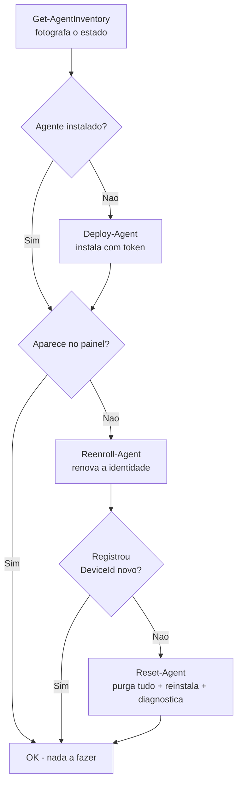

# Remote MSI Deploy


Toolkit em **PowerShell + PsExec** para instalar, re-registrar (re-enroll) e diagnosticar um agente de monitoramento (`.msi`) em massa nas estações de um domínio Windows — **sem depender de WinRM**, que costuma estar desabilitado em parques legados.

Nasceu de um caso real: dezenas de estações precisavam receber um agente de monitoramento, parte delas tinha o agente instalado mas **não aparecia no painel** (identidade órfã no servidor), e o WinRM estava desabilitado em todas. O toolkit resolve o ciclo completo: deploy → detecção de instalação existente → re-enroll → reset completo → diagnóstico de conectividade, sempre com relatório em CSV por execução.

## Por que PsExec e não WinRM/GPO?

| Método | Situação encontrada |
|---|---|
| `Invoke-Command` (WinRM) | Desabilitado nas estações; habilitar exigiria GPO + reinício do ciclo |
| GPO Software Installation | Instala apenas no boot/logon; sem feedback imediato; difícil segmentar máquinas avulsas |
| **PsExec (SMB + SCM)** | **Funciona onde `C$` funciona; execução como SYSTEM; código de saída capturável** |

## Quando usar cada script



Escale a agressividade da esquerda para a direita — **inventário → deploy → re-enroll → reset**. O reset destrói o estado local; use por último.

## Estrutura

Config centralizado + biblioteca compartilhada. Você ajusta **um** arquivo (`config.psd1`) e todos os scripts o consomem. Tudo é portátil (`$PSScriptRoot`): clone a pasta para qualquer servidor de gestão e rode de lá.

```
remote-msi-deploy/
├── config.psd1            # SUA config (não versionada — ver config.example.psd1)
├── Agent.msi              # instalador (não versionado)
├── token.txt              # token de enrollment (não versionado)
├── PSTools/PsExec64.exe   # Sysinternals (não versionado)
├── lib/
│   └── Common.ps1         # loader de config + helpers (ping, PsExec, relatório)
├── scripts/
│   ├── Get-AgentInventory.ps1   # snapshot: DeviceId, serviço, versão (só leitura)
│   ├── Deploy-Agent.ps1         # instala onde falta (idempotente)
│   ├── Reenroll-Agent.ps1       # força novo registro no servidor
│   └── Reset-Agent.ps1          # purga estado + reinstala + diagnostica
└── docs/
    ├── USAGE.md           # setup e passo a passo
    └── CASE-STUDY.md      # a investigação real que originou o toolkit
```

## Início rápido

```powershell
# 1. Coloque Agent.msi, token.txt e PSTools\ na raiz
# 2. Copie config.example.psd1 -> config.psd1 e ajuste nomes/máquinas do seu agente
# 3. Abra o menu de fluxos (como administrador):
cd <pasta-do-repo>
powershell -ExecutionPolicy Bypass -File .\Menu.ps1
```

### Menu de fluxos (`Menu.ps1`)

Um único lançador dá acesso a todos os fluxos — sem decorar comando:

```
==================================================
  Remote MSI Deploy - fluxos internos
  Agente : *Monitor Agent*   Servico: MonitorAgent
  Alvos  : 12 maquina(s)
==================================================
  1) Inventario  (somente leitura)
  2) Deploy      (instala onde falta - idempotente)
  3) Re-enroll   (renova identidade)
  4) Reset       (purga + reinstala + diagnostica)
  0) Sair
```

- **Duplo-clique:** `Executar.cmd` abre o menu já elevado (UAC).
- **Automação:** `.\Menu.ps1 -Flow Deploy` roda um fluxo direto, sem menu (aceita `Inventory|Deploy|Reenroll|Reset`).
- O **Reset** pede confirmação digitada antes de agir.

Passo a passo completo (inclusive como descobrir os nomes do seu agente): **[docs/USAGE.md](docs/USAGE.md)**. Cada execução grava um `resultado_<operacao>_<timestamp>.csv` auditável na raiz.

## Os quatro scripts

### 1. `Deploy-Agent.ps1` — instalar onde falta
Por máquina: **ping** (evita travar em host desligado) → acesso `C$` → detecta instalação existente **pelo DisplayName no registro de Uninstall** → copia o MSI → `msiexec /i ... TOKEN_PROPERTY="<token>" /qn` como SYSTEM. Máquinas que já têm o agente são puladas — é seguro re-executar quantas vezes quiser.

> **Por que detectar pelo DisplayName e não pelo ProductCode?** Instaladores WiX geram um ProductCode **novo a cada versão** (major upgrade). Checar o ProductCode do seu MSI não encontra a versão anterior instalada → o instalador aborta com `1603` por proteção de downgrade. A busca por nome funciona para qualquer versão.

### 2. `Reenroll-Agent.ps1` — consertar "instalado mas offline no painel"
O cenário mais traiçoeiro: o agente roda, mas o painel não mostra a máquina. Causa: a chave de identidade (`DeviceId`/`DeviceToken` em `HKLM\SOFTWARE\<Agent>`) **sobrevive à desinstalação do MSI**. O agente reinstalado reutiliza a identidade antiga — que foi removida/orfanada no servidor — e nunca se registra de novo.

O script força o re-registro **sem reinstalar nada**:

```
parar serviço → apagar DeviceId + DeviceToken + buffer local → iniciar serviço
```

O agente encontra o token de instalação (que permanece no registro), registra-se do zero e ganha um DeviceId novo. Validado em produção: identidades antigas (id 9, 34, 37, 72...) renovadas para ids ativos em segundos.

### 3. `Reset-Agent.ps1` — o martelo: reset completo + diagnóstico
Para máquinas que resistem ao re-enroll: desinstala **todas** as versões encontradas, **purga** a chave de registro inteira e o `ProgramData`, reinstala com o token e, ao final, roda um diagnóstico de conectividade (HTTP ao servidor, teste TCP na porta 443 e na porta do websocket). Cada máquina gera um `diag_<PC>.txt` e uma linha-resumo:

```
RESULT;ExitInstall=0;DeviceId=171;Servico=Running;HTTP=OK/200;P443=True;ReverbPort=False
```

### 4. `Get-AgentInventory.ps1` — fotografia sem efeitos colaterais
Somente leitura: DeviceId, status do serviço e presença do agente em cada máquina. Use antes e depois de qualquer operação em massa.

## Troubleshooting de campo (lições que custaram horas)

| Sintoma | Causa real | Correção |
|---|---|---|
| `1603` ao reinstalar | Versão igual/maior já instalada (proteção de downgrade do WiX) | Detectar por DisplayName e pular, ou usar o Reset |
| Instalado mas invisível no painel | `DeviceId` órfão sobrevive ao uninstall | `Reenroll-Agent.ps1` (não adianta reinstalar!) |
| PsExec: *"service marked for deletion"* | `PSEXESVC` preso no alvo (handle aberto) | Flag `-r <nome>` usa um serviço com outro nome |
| Script trava minutos em máquina desligada | Timeout longo do SMB | `Test-Connection` (ping) **antes** de tocar SMB |
| Registro ok, mas painel oscila offline | Porta do websocket bloqueada no firewall | Testar a porta com `Test-NetConnection`; liberar saída |
| MSI instala mas token não aplica | Propriedade passada com nome errado | Ler `SecureCustomProperties` do MSI (script na wiki) |

Detalhes e a investigação completa: [docs/CASE-STUDY.md](docs/CASE-STUDY.md).

## Segurança

- `token.txt`, MSI, binários da Sysinternals e CSVs de resultado estão no `.gitignore` — **nunca** versione tokens.
- Os scripts rodam como SYSTEM nas máquinas-alvo; execute-os apenas de um servidor de gestão controlado, com conta autorizada.
- Se precisar desabilitar firewall para diagnóstico, faça por janela mínima e **reative ao final** (os comandos de reativação estão no case study).

## Requisitos

- Windows PowerShell 5.1+ no servidor de gestão
- [Sysinternals PsTools](https://learn.microsoft.com/sysinternals/downloads/psexec) (PsExec64)
- Compartilhamentos administrativos (`C$`/`ADMIN$`) acessíveis nas máquinas-alvo
- Conta com privilégio administrativo nas estações

## Licença

[MIT](LICENSE)
